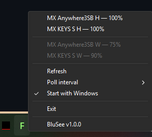

# BluSee

A small Windows tray app that shows the battery level of wireless keyboards and mice.
The tray icon shows the lowest battery percentage among connected devices. The menu lists every device.



## About this project

- I wrote this for my own use, as a personal hobby project.
- Claude (Anthropic's AI assistant) wrote the code under my supervision and review.
- The software is provided **as is**, without warranty of any kind.
- There are no support, maintenance or compatibility commitments. Issues and pull requests may go unanswered.
- Use it at your own risk.

## What it reads

| Source | Devices |
|---|---|
| Windows PnP battery property (OS cache) | Bluetooth Classic, some USB-receiver devices |
| BLE GATT Battery Service (0x180F / 0x2A19) | Bluetooth Low Energy devices paired directly |
| Logitech HID++ | Devices behind a Logi Bolt / Unifying receiver |

The app remembers the last reading of each device, so a sleeping device still shows its last known level.

## Requirements

- Windows 10 (19041) or later, x64.
- The release `blusee.exe` is a self-contained NativeAOT build. It does not need an installed .NET runtime.

## Usage

1. Put `blusee.exe` in any folder where you can write files. The app is portable and keeps all its files next to the exe.
2. Run the exe. The icon appears in the notification area.
3. Right-click the icon for the device list (connected devices first; disconnected ones grayed out below a separator, with their last known level), Refresh, Poll interval and Start with Windows. A low battery shows a balloon warning.

### Files next to the exe

| File | Purpose |
|---|---|
| `blusee.ini` | Settings, edited by hand |
| `blusee.devices.json` | Last known device readings and user aliases |
| `blusee.log` | Trace log, only when `Debug=on` |

### Settings (`blusee.ini`)

| Key | Default | Meaning |
|---|---|---|
| `PollIntervalMinutes` | `10` | Poll interval, 1..1440 minutes |
| `IconScalePercent` | `100` | Size of the tray digits, 30..100 |
| `Debug` | `off` | `on` writes a trace of every poll to `blusee.log` |

### Custom device names

Two devices of the same model report the same name. To tell them apart, set `Alias` in `blusee.devices.json`:

```json
{
  "Device": { "Id": "BluetoothLE#...-dd:c4:f1:16:f3:f0", "Name": "MX KEYS S", "...": "..." },
  "SavedAtUtc": "...",
  "Alias": "Keys Home"
}
```

Polls do not overwrite `Alias`. Close the app before you edit the file, because the app overwrites the file with its in-memory state.

## Build

The release `blusee.exe` is a NativeAOT build: native machine code with no JIT at run time.
For an app that runs all day in the tray, this gives a lower memory footprint and an instant start.
The code is kept NativeAOT-compatible: JSON uses source generation, and PnP reads use CfgMgr32 P/Invoke instead of WinRT property lists.

Requirements:

- .NET 10 SDK.
- MSVC x64 build tools (`link.exe`) and the Windows 10/11 SDK libraries (`ucrt`, `um`).
- Permission to run `ilc.exe` from the NuGet cache. Group policies on managed machines can block it.

With a standard Visual Studio "Desktop development with C++" install, run the command from a "x64 Native Tools Command Prompt":

```
dotnet publish src\BluSee -c Release -r win-x64 -p:PublishAot=true -o publish
```

`aot-publish.bat` does the same for a Visual Studio install that the ILC tool discovery (vswhere) cannot find. It sets `PATH` and `LIB` by hand. Before you run it, check `VCDIR` (MSVC version) and `SDKLIB` (Windows SDK version) against your install.


Without the MSVC toolchain, a trimmed single-file build needs only the .NET 10 SDK. It is larger (about 12 MB) and uses more memory than the NativeAOT build:

```
dotnet publish src\BluSee -c Release -r win-x64 --self-contained -p:PublishSingleFile=true -p:PublishTrimmed=true -p:EnableCompressionInSingleFile=true -o publish
```
